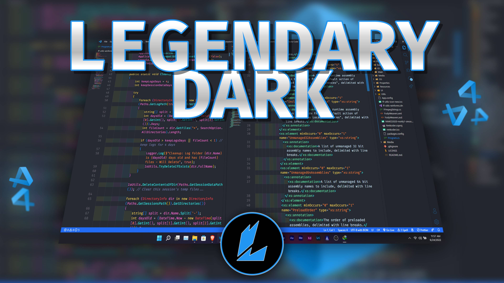

# Legendary Dark - VS Code theme

   

# **Legendary Dark**

**This theme works best with Bracket pair colorizer and indent-rainbow all VS Code Extensions which can be found in the store.**

**This theme includes the dark goodness of Andromeda and the color syntax of synthwave '84.**

---
## License:
[MIT](https://github.com/Llewellyn500/Legendary-Dark/blob/master/LICENSE.md)
