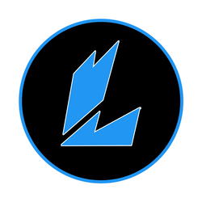

# Legendary Dark - VS Code theme

  
  
  

> **NOTE**: This theme includes the dark goodness of Andromeda and the color syntax of synthwave '84.

## License

[MIT](https://github.com/Llewellyn500/Legendary-Dark/blob/master/LICENSE.md)
